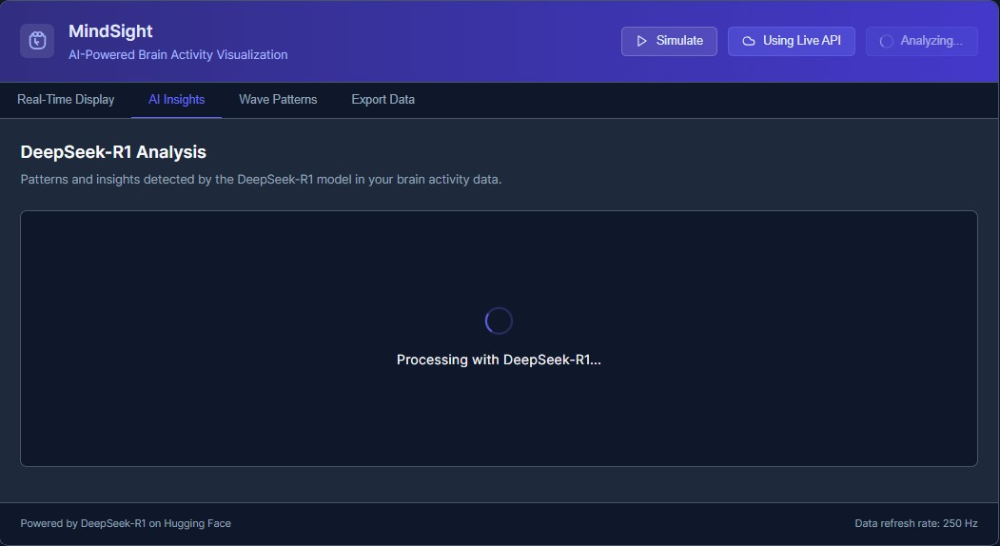
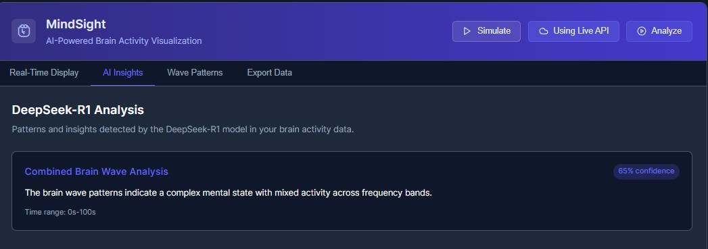

# MindSight

<p align="center">
  
</p>


## AI-Powered Brain Activity Visualization and Analysis

MindSight is an innovative web application for visualizing and analyzing brain wave activity using advanced machine learning. Built with React and integrating with Hugging Face's DeepSeek-R1 model, it demonstrates the potential of AI in neuroscience applications.

[](https://reactjs.org/)
[](https://huggingface.co/)
[](https://huggingface.co/)
[](https://recharts.org/)
[](https://mindsight-demo.netlify.app/)

## 🧠 Live AI Analysis

MindSight integrates with DeepSeek-R1 to provide real-time analysis of brain wave patterns, identifying mental states and neural correlations with confidence metrics.

<p align="center">
  
</p>

<p align="center">
  
</p>

## ✨ Features

- **Real-time Brain Wave Visualization:** Interactive monitoring of alpha, beta, theta, delta, and gamma brain waves with dynamic updates.
- **AI-Powered Pattern Recognition:** Integration with DeepSeek-R1 AI model for advanced neural pattern analysis and mental state identification.
- **Confidence-scored Insights:** Analysis results with reliability metrics for detected patterns and correlations.
- **Comprehensive Wave Information:** Detailed information about different brain wave types and their significance.
- **Data Export Capabilities:** Export raw data and analysis results in multiple formats (CSV, JSON, PDF) for further research.

## 🧠 Brain Wave Analysis

MindSight visualizes and analyzes five primary types of brain waves:

| Wave Type | Frequency | Mental State |
|-----------|-----------|--------------|
| Alpha | 8-13 Hz | Relaxed, calm mental state |
| Beta | 13-30 Hz | Alert, actively thinking |
| Theta | 4-8 Hz | Deep meditation, sleep |
| Delta | 0.5-4 Hz | Deep sleep, regeneration |
| Gamma | 30-100 Hz | High cognitive processing |

The AI component analyzes relationships between different wave types to identify patterns indicating specific mental states, such as:
- Alpha-Beta correlation suggesting relaxed but alert states
- Theta spikes indicating moments of deep focus
- Gamma bursts corresponding to complex information processing

## 🛠️ Technology Stack

- **Frontend:** React with functional components and hooks
- **Data Visualization:** Recharts for interactive and responsive charts
- **AI Integration:** Hugging Face's DeepSeek-R1 model via Inference API
- **Styling:** CSS with responsive design for all device sizes
- **Data Processing:** Custom algorithms for real-time synthetic data generation

## 📊 Dashboard Interface

MindSight features an intuitive dashboard with multiple views:

- **Real-time Display:** Live visualization of brain wave activity across all frequency bands
- **AI Insights:** Neural pattern analysis with confidence scoring and time range indicators
- **Wave Patterns:** Educational reference on different brain wave types and their significance
- **Export Data:** Options to download raw data and analysis results in various formats

## 🚀 Getting Started

### Prerequisites

- Node.js 16.0 or higher
- npm or yarn

### Installation

1. Clone the repository:
   ```bash
   git clone https://github.com/ayaan-cis/MindSight.git
   cd MindSight
   ```

2. Install dependencies:
   ```bash
   npm install
   ```

3. Create a `.env` file in the project root and add your Hugging Face API token:
   ```
   REACT_APP_HUGGING_FACE_TOKEN=your_token_here
   REACT_APP_USE_REAL_API=true
   ```

4. Start the development server:
   ```bash
   npm start
   ```

## 🧪 Using the Application

1. **View Real-time Data:** The default view shows real-time brain wave visualization.
2. **Simulate Activity:** Click the "Simulate" button to start generating synthetic brain wave data.
3. **Analyze Patterns:** Press "Analyze" to process the current data with the DeepSeek-R1 AI model.
4. **Explore Insights:** Switch to the "AI Insights" tab to see detected patterns and their significance.
5. **Learn More:** Visit the "Wave Patterns" tab for educational information about brain waves.
6. **Export Data:** Use the "Export Data" tab to download your data in various formats.

## 📱 Responsive Design

MindSight is designed to work seamlessly across devices:
- Desktop: Full dashboard experience with expanded visualizations
- Tablet: Optimized layout for medium-sized screens
- Mobile: Compact interface with touch-friendly controls

## 🔒 Data Privacy

MindSight is designed with privacy in mind:
- All data processing occurs client-side
- No personal data is stored or transmitted
- API tokens are securely managed through environment variables

## 🤝 Contributing

Contributions are welcome! Please feel free to submit a Pull Request.

1. Fork the repository
2. Create your feature branch (`git checkout -b feature/amazing-feature`)
3. Commit your changes (`git commit -m 'Add some amazing feature'`)
4. Push to the branch (`git push origin feature/amazing-feature`)
5. Open a Pull Request

## 📄 License

This project is licensed under the Apache License 2.0 - see the [LICENSE](LICENSE) file for details.

## 📧 Contact

Ayaan A. Syed - [LinkedIn](http://www.linkedin.com/in/ayaan-syed) - [GitHub](https://github.com/ayaan-cis)
Zaayan M. Javed - [LinkedIn](http://www.linkedin.com/in/zaayan-javed) - [GitHub](https://github.com/ZaayanJ)

Project Link: [https://mindsight-app.netlify.app/](https://mindsight-app.netlify.app/)

---

<p align="center">
  <em>Visualizing the mind, one wave at a time.</em>
</p>
