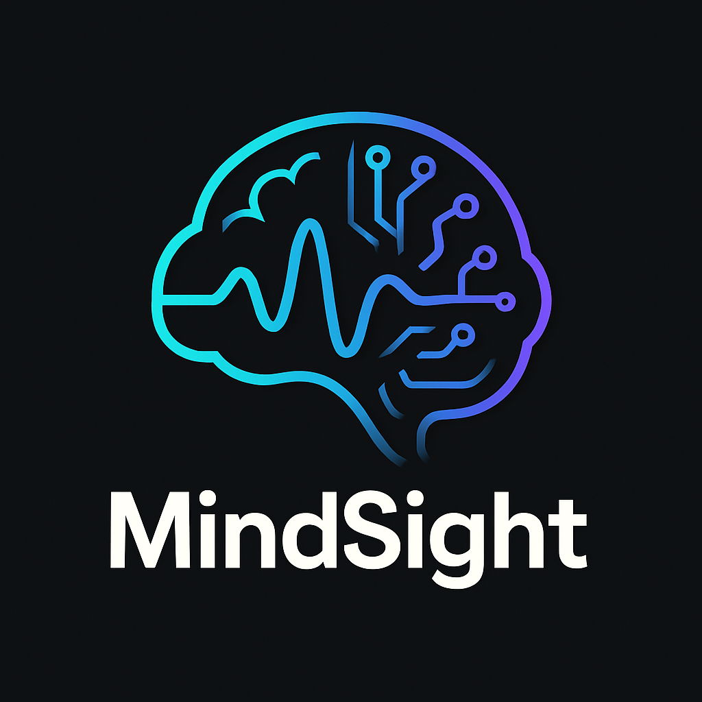
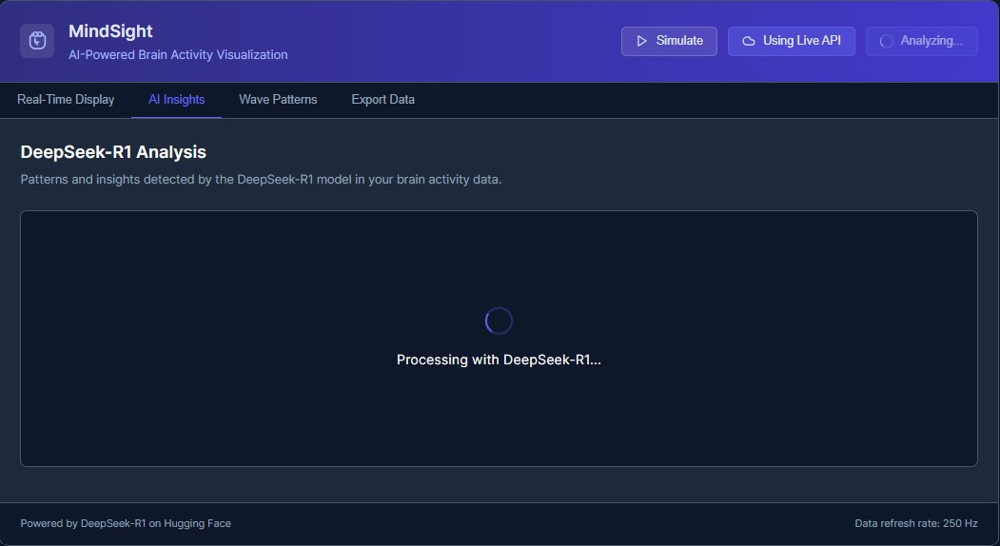
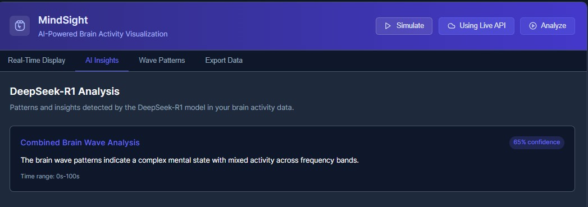

# MindSight

<p align="center">
  
</p>


## AI-Powered Brain Activity Visualization and Analysis

MindSight is an innovative web application for visualizing and analyzing brain wave activity using advanced machine learning. Built with React and integrating with Hugging Face's DeepSeek-R1 model, it demonstrates the potential of AI in neuroscience applications.

[](https://reactjs.org/)
[](https://huggingface.co/)
[](https://huggingface.co/)
[](https://recharts.org/)
[](https://mindsight-demo.netlify.app/)

## 🧠 Live AI Analysis

MindSight integrates with DeepSeek-R1 to provide real-time analysis of brain wave patterns, identifying mental states and neural correlations with confidence metrics.

<p align="center">
  
</p>

<p align="center">
  
</p>

## ✨ Features

- **Clinical-style EEG workspace:** One merged viewer — no split between “educational” and “research” modes.
- **Three-panel reading:** Raw signal, then band measurements, then a clearly separated model interpretation.
- **Pattern-coded brain rhythms:** Alpha, beta, theta, delta, and gamma keep the same symbol, colour, and fill so they stay distinguishable without relying on hue.
- **Plain-language labels:** Channel names, ratios, and caveats written for people who are curious, not only for clinicians.
- **AI-powered pattern reading:** Optional DeepSeek-R1 interpretation with confidence, evidence, and an honest “what this cannot tell you” list.
- **Data you can borrow or bring:** PhysioNet-style sample recordings, a labelled practice signal, or your own `.csv` / `.edf` / `.json` file (it stays in the browser).
- **Export with provenance:** CSV, JSON, and a printed report that always says whether the signal was real or generated.


## 🧠 Brain Wave Analysis

MindSight visualizes and analyzes five primary types of brain waves:

| Wave Type | Frequency | In plain words |
|-----------|-----------|----------------|
| Delta | 0.5–4 Hz | Deep, dreamless sleep |
| Theta | 4–8 Hz | Drowsy, drifting, light sleep |
| Alpha | 8–13 Hz | Calm and awake, especially with eyes closed |
| Beta | 13–30 Hz | Alert, thinking, concentrating |
| Gamma | 30–100 Hz | Brief bursts during demanding mental work |


The AI component analyzes relationships between different wave types to identify patterns indicating specific mental states, such as:
- Alpha-Beta correlation suggesting relaxed but alert states
- Theta spikes indicating moments of deep focus
- Gamma bursts corresponding to complex information processing

## 🛠️ Technology Stack

- **Frontend:** React with functional components and hooks
- **Data Visualization:** Recharts for interactive and responsive charts
- **AI Integration:** Hugging Face's DeepSeek-R1 model via Inference API
- **Styling:** CSS with responsive design for all device sizes
- **Data Processing:** Custom algorithms for real-time synthetic data generation

## 📊 Dashboard Interface

MindSight is a single workspace with five screens:

- **Overview:** What EEG is, a sample trace, and the three-step reading model.
- **Load data:** Borrow a PhysioNet-style recording, try a labelled practice signal, or drop your own file.
- **Workspace:** 01 the wave itself → 02 what we measured → 03 what it might mean.
- **Band reference:** The five rhythms in plain words, with the same glyphs used everywhere else.
- **Export:** CSV samples, JSON measurements, and a printed report with provenance.


## 🚀 Getting Started

### Prerequisites

- Node.js 16.0 or higher
- npm or yarn

### Installation

1. Clone the repository:
   ```bash
   git clone https://github.com/ayaan-cs/MindSight.git
   cd MindSight
   ```

2. Install dependencies:
   ```bash
   npm install
   ```

3. Create a `.env` file in the project root and add your Hugging Face API token:
   ```
   REACT_APP_HUGGING_FACE_TOKEN=your_token_here
   REACT_APP_USE_REAL_API=true
   ```

4. Start the development server:
   ```bash
   npm start
   ```

## 🧪 Using the Application

1. **Start on Overview:** Read the short introduction, or skip straight to a recording.
2. **Load data:** Open a resting-state sample, a motor-imagery excerpt, or the practice signal.
3. **Watch the wave:** Play or pause the montage; change the time window if you want a closer look.
4. **Read the numbers:** Panel 02 shows band energy, ratios, and signal quality — measurements, not opinions.
5. **Ask what it might mean:** Panel 03 sends only those numbers to DeepSeek-R1 (or a local reading) and keeps the answer visually separate.
6. **Export:** Download CSV, JSON, or a printed report. Every file says whether the signal was real or generated.


## 📱 Responsive Design

MindSight is designed to work seamlessly across devices:
- Desktop: Full dashboard experience with expanded visualizations
- Tablet: Optimized layout for medium-sized screens
- Mobile: Compact interface with touch-friendly controls

## 🔒 Data Privacy

MindSight is designed with privacy in mind:
- All data processing occurs client-side
- No personal data is stored or transmitted
- API tokens are securely managed through environment variables

## 🤝 Contributing

Contributions are welcome! Please feel free to submit a Pull Request.

1. Fork the repository
2. Create your feature branch (`git checkout -b feature/amazing-feature`)
3. Commit your changes (`git commit -m 'Add some amazing feature'`)
4. Push to the branch (`git push origin feature/amazing-feature`)
5. Open a Pull Request

## 📄 License

This project is licensed under the Apache License 2.0 - see the [LICENSE](LICENSE) file for details.

## 📧 Contact

**Ayaan A. Syed** - [LinkedIn](http://www.linkedin.com/in/ayaan-syed) - [GitHub](https://github.com/ayaan-cs)

Project Link: [https://mindsight-app.netlify.app/](https://mindsight-app.netlify.app/)

---

<p align="center">
  <em>Visualizing the mind, one wave at a time.</em>
</p>
